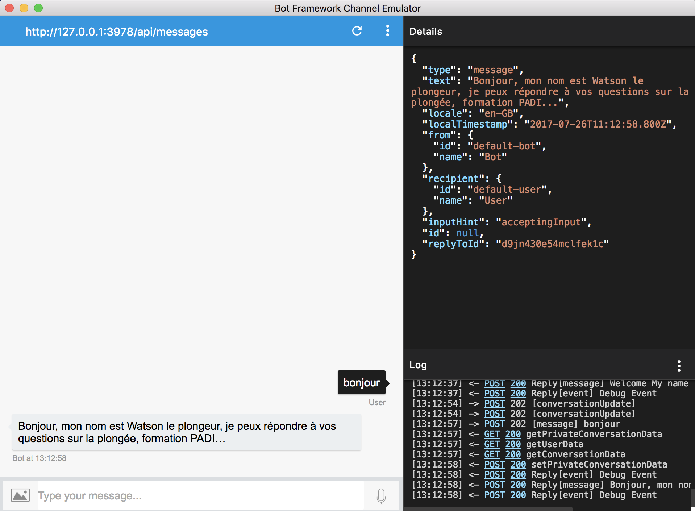
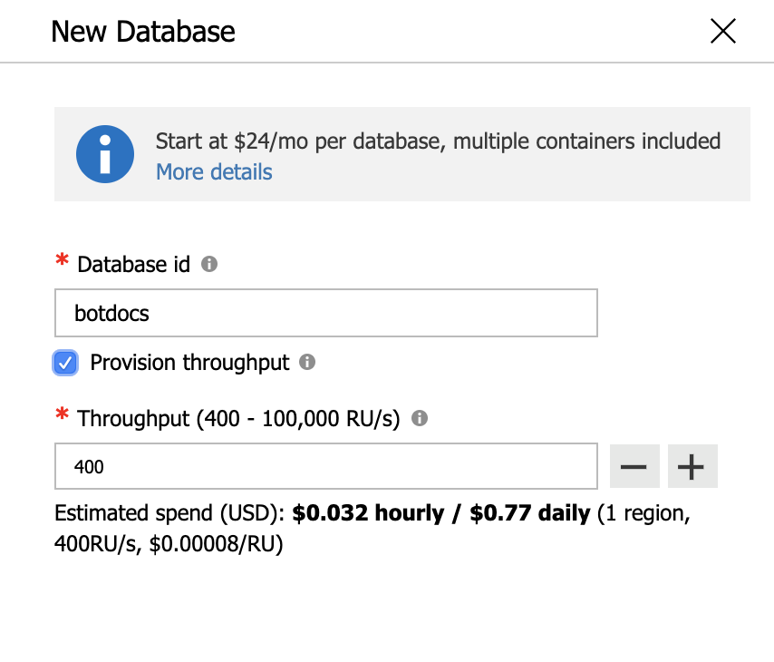
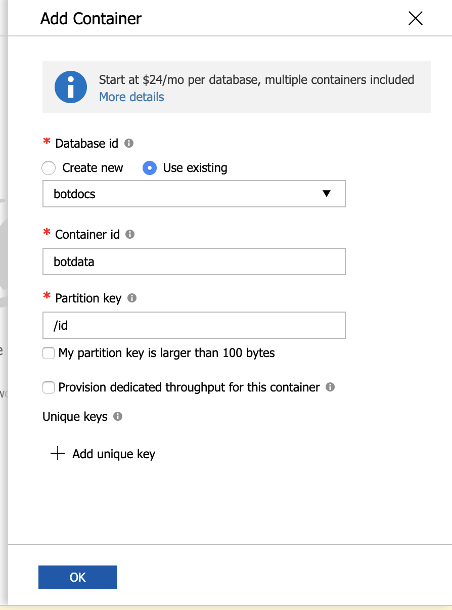
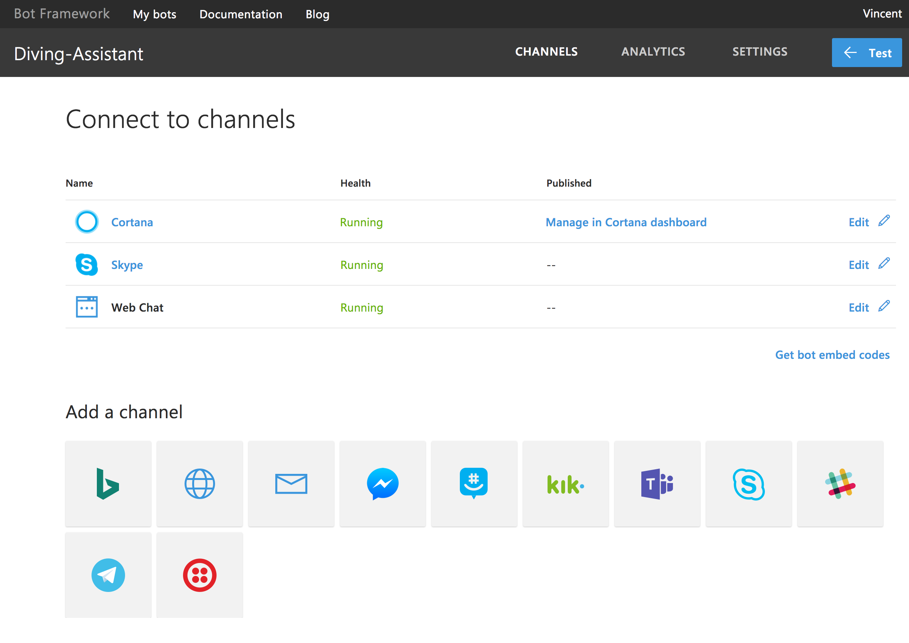

# Microsoft Bot Framework Connector for IBM Watson Assistant
A solution that connects Azure Bot Service to a bot that is build in IBM Watson Assistant. This allows you to make your IBM bot available on [all channels that are supported by Azure Bot Service](https://docs.microsoft.com/en-us/azure/bot-service/bot-service-channels-reference?view=azure-bot-service-4.0#summary-of-activities-supported-per-channel).

## WORK IN PROGRESS

Please note that this is a fork of [Vincent Perrin's repository](https://github.com/vperrinfr/BotBuilder-Watson). I am converting this so it works with IBM Watson Asisstant V2 API. This project is not functional yet, but you are welcome to [contribute](#Contributing).

| Task | Status |
|------|--------|
| Update IBM SDK (replace `watson-developer-cloud` with `ibm-watson` package) | ✅ Done |
| Update README | 🔄 In progress |
| Fix session management (application now creates a new session with IBM for every user message) | To do |
| Update Bot Framework Node.js SDK (`bot-builder`) to 4.x.x | To do |
| Add other storage options for state besides CosmosDB | To do |
| Update README | To do |
| Add a 'Deploy to Azure App Service' button | To do |

## Contributing

If you would like to contribute to this project by working on the tasks listed above, you are very welcome to do so. You can either fork this project and make Pull Requests from there, or [Create an issue](https://github.com/EdwinOtten/BotBuilder-WatsonV2/issues/new) and ask me to add you as a collaborator.

## Introduction

The Microsoft Bot Framework provides just what you need to build and connect intelligent bots that interact naturally wherever your users are talking, from text/sms to Skype, Teams, Slack, Office 365 mail and other popular services. [More details](https://dev.botframework.com/)

IBM Watson Assistant helps you to quickly build and deploy chatbots and virtual agents across a variety of channels, including mobile devices, messaging platforms. [More details](https://www.ibm.com/cloud/watson-assistant/)

## Prerequisites

The minimum prerequisites to run this sample are:

* Node.js 10 or above with NPM. Download it from [here](https://nodejs.org/en/download/).

* Bot Framework Emulator. Download it [here](https://github.com/microsoft/BotFramework-Emulator/releases/latest). More information about the emulator can be found in [this documentation article](https://docs.microsoft.com/en-us/azure/bot-service/bot-service-debug-emulator?view=azure-bot-service-4.0&tabs=csharp).

* Credentials of your Watson Assistant

  * This project requires some credentials to be able to communicate with your Watson Assistant. The [Instructions](#Instructions) paragraph will explain how to configure this.
    
* Register your bot with the Microsoft Bot Framework. Please refer to [this](https://docs.microsoft.com/en-us/bot-framework/portal-register-bot) for the instructions. Once you complete the registration, update your bot configuration with the registered config values (See [Debugging locally using ngrok](https://docs.microsoft.com/en-us/bot-framework/debug-bots-emulator) or [Deploying to IBM Bluemix](https://console.bluemix.net/docs/runtimes/nodejs/getting-started.html#getting-started-with-node-js-on-bluemix))

* An Azure CosmosDB

## Instructions

1. Create an IBM Cloud & a Watson Assistant project

    * In case, you don't have it: [Register for IBM Cloud](https://cloud.ibm.com/registration), or use an existing account

2. Acquire Watson Assistant credentials

  * Check out the `.env_example` file to see which settings are required. To find the credentials, read IBM's documentation on this: [Finding credentials in the UI](https://cloud.ibm.com/apidocs/assistant/assistant-v2#finding-credentials-in-the-ui).

3. Acquire Azure App registration details

4. Copy or rename the .env_example file to .env (nothing before the dot) and add your Watson Assistant details and Microsoft Bot app keys.

5. Before deploying that code, I recommend you fork it to test it locally with BotFramework emulator. [more details](https://docs.microsoft.com/en-us/bot-framework/debug-bots-emulator)

6. Set up your Azure storage with the following steps.
  * Create an Azure account if you dod not already have one. This should be the account that you used for creating your bot
  * Create a CosmoDB database inside that account named _botdocs_  
   
  * Inside that database, create a collection named _botdata_ make sure that the partition key is _id_
   
  * Make a note of the _PRIMARY KEY_ associated with your account. This must be stored in the environment file as _storageKey_
  * Take note of the URI associated with your bot account, It will be something like :
https://<bot_name>.documents.azure.com:443/ - this will be the _storageURL_ you will save in your environment file below.

## Results

Channels supported by Bot Framework

## More Information

To get more information about how to get started, please review the following resources:
* [Watson Asisstant documenation](https://cloud.ibm.com/docs/services/assistant?topic=assistant-getting-started)
* [Watson Assistant](https://www.ibm.com/cloud/watson-assistant/)
* [Microsoft Bot Builder for Node.js Reference](https://docs.microsoft.com/en-us/bot-framework/nodejs/) (this project uses v3)
* [Azure Bot Service documentation](https://docs.microsoft.com/en-us/azure/bot-service/?view=azure-bot-service-4.0)

